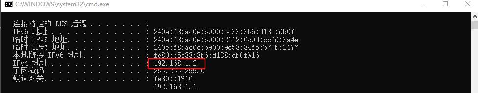

# 介绍
这是一个轻量级的本地服务器。可以在PC上跑。实现的功能是，把你的图片展示在页面上，可以用手机和平板电脑或者其他电脑查看。
当然，这要保证你的几个设备在同一个网络中。

# 使用方法

## 安装
pip install -r requirements.txt

## 配置图片目录
我们的目的是展示图片，那么我们的static目录下必须有图片，我们做一个软链接到images下，比如:

picture_web\static\images>mklink /j source1 D:\照片\Downloads
为 source1 <<===>> D:\照片\Downloads 创建的联接

这是在images下创建了一个source1的软链接，链接到了 “D:\照片\Downloads”，你的照片就存在这里

## 使用
python.exe -m flask run --host=0.0.0.0
 * Serving Flask app "app.py"
 * Environment: development
 * Debug mode: off
 * Running on http://0.0.0.0:5000/ (Press CTRL+C to quit)

 
 
 在浏览器中输入 http://192.168.1.2:5000/ 即可查看
 
 ## 远程使用
 如果你的手机或者平板电脑查看图片的时候，需要你的笔记本打开热点，然后手机连上。在浏览器输入上述地址就可以访问
 或者在家里，手机连上WiFi的情况下，电脑和手机一般都在同一个网络。可以直接在浏览器输入地址，即可访问
 就比如这样：
 
  